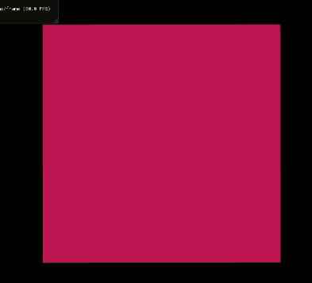
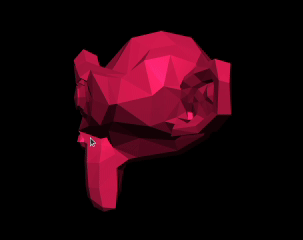

# OpenGL experiments

## Rotating cubes with lighting

Some rotating cubes in 3D with the Phong reflection model. 

## Jelly!

2D simulation of some jelly. The model is a grid of vertices connected by springs. The evolution of the positions is computed with the Verlet method. 

## Suzanne

Suzanne monkey from Blender. The model is loaded from a .ply file that contains the vertex and triangle information. 

## References

The base code was built following the OpenGL tutorial series from TheCherno https://youtube.com/playlist?list=PLlrATfBNZ98foTJPJ_Ev03o2oq3-GGOS2
To get the full code from all the episodes you can support him on Patreon https://www.patreon.com/thecherno

I tweaked some things from the tutorial and I'm also including more tests to keep learning other OpenGL topics that were not covered by the tutorial.

For the lighting experiments I'm following https://learnopengl.com/Lighting/Basic-Lighting
